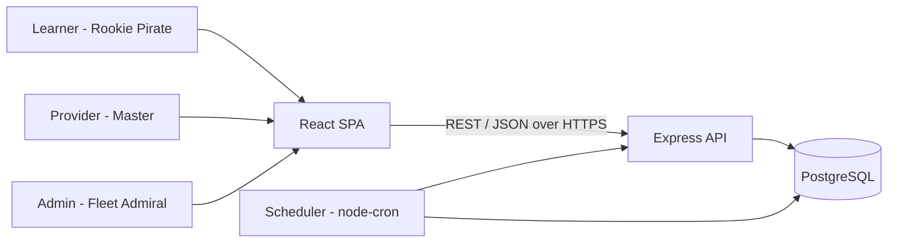
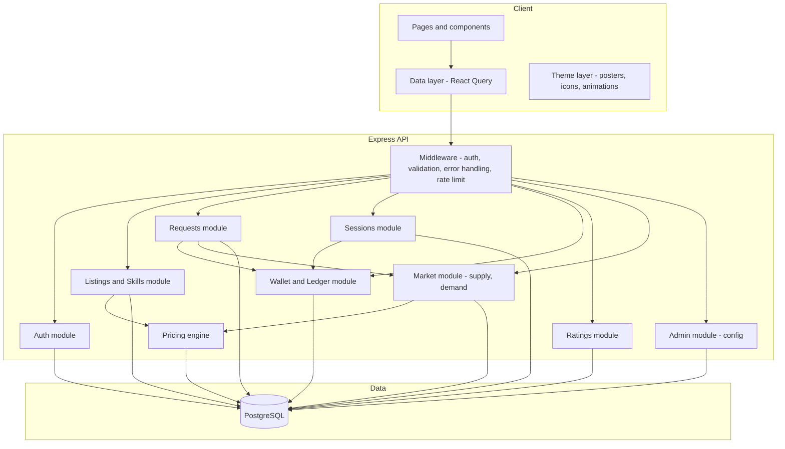
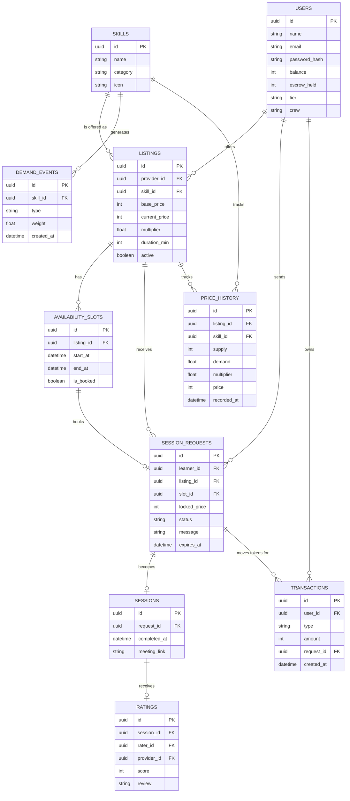
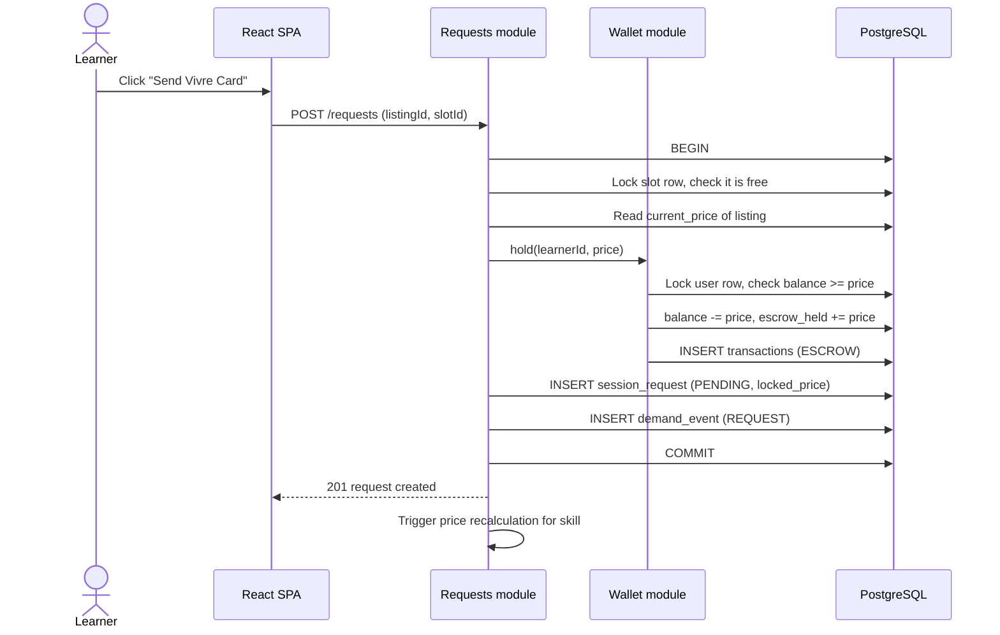
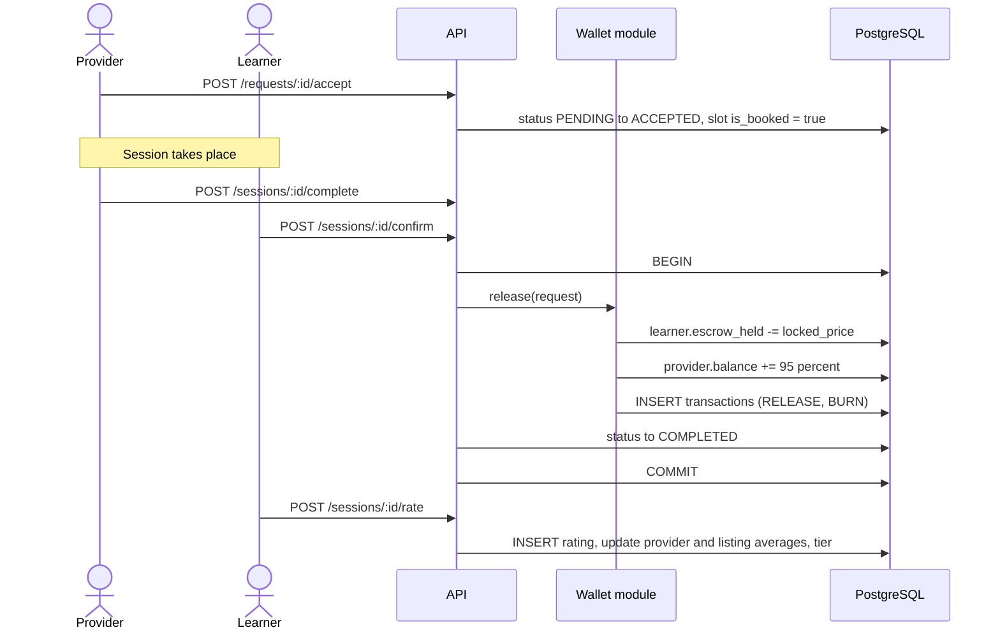
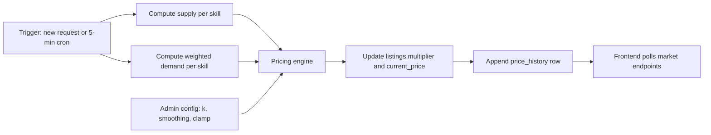
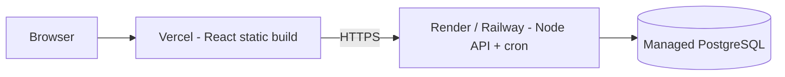

# Architecture — Grand Line Skill Exchange
**Problem Statement:** PS-05 — Peer-to-Peer Skill Marketplace with Demand-Based Pricing
**Companion doc:** `PRD.md`
**Version:** 1.0 (Hackathon MVP)

---

## 1. Architecture Summary

A three-tier web application, built as a **modular monolith** for speed and simplicity:

- **Frontend:** React SPA (Vite + Tailwind) with the One Piece theme layer.
- **Backend:** Node.js + Express REST API, organised into domain modules (auth, listings, requests, sessions, wallet, ratings, market).
- **Database:** PostgreSQL (source of truth for users, listings, sessions and the token ledger).
- **Background jobs:** in-process scheduler (`node-cron`) for price recalculation and request expiry.

**Why a monolith:** one deployable, one database, atomic transactions across tokens and sessions, and far less to debug in a hackathon. Module boundaries are kept clean so it could be split later.

**Design principles**
1. **The ledger is the source of truth for tokens.** Balances are always explainable from transactions.
2. **Every token movement is atomic.** Escrow, release and refund run inside database transactions.
3. **Pricing is a pure function.** Inputs in, price out, easy to test and to explain.
4. **Price is locked at request time.** Later surges never change an existing request.
5. **Function first, theme second.** Theme lives in the UI layer and in seed data, not in business logic.

## 2. System Context



## 3. Component Architecture



### Module responsibilities

| Module | Responsibility |
|---|---|
| **Auth** | Register, login, JWT issue and verify, password hashing (bcrypt), 500 VCT starting grant. |
| **Listings / Skills** | Skills catalogue, provider listings, availability slots, search and filter queries. |
| **Requests** | Create, accept, reject, cancel and expire session requests; locks price; triggers escrow. |
| **Sessions** | Mark complete, learner confirmation, auto-confirm, dispute flag. |
| **Wallet / Ledger** | Balances, escrow hold, release, refund, burn; append-only transaction log. |
| **Ratings** | One rating per completed session; recomputes provider and listing averages and tier. |
| **Market** | Records demand events, computes supply, exposes market overview and price history. |
| **Pricing engine** | Pure function that turns base price, supply and demand into a multiplier and price. |
| **Admin** | Pricing parameters (`k`, smoothing, clamp band, window), simulate-demand action. |

## 4. Technology Choices

| Layer | Choice | Rationale |
|---|---|---|
| Frontend | React 18 + Vite | Fast dev loop, large ecosystem, easy to AI-assist. |
| Styling | Tailwind CSS | Quick, consistent theming (parchment and ocean palette as design tokens). |
| Charts | Recharts | Price history and supply/demand charts with little code. |
| Data fetching | TanStack React Query | Caching, refetch on interval for the live price ticker. |
| Backend | Node.js 20 + Express | Simple, well known. |
| ORM | Prisma | Typed schema, migrations, transaction API. |
| Database | PostgreSQL (SQLite for local quick start) | Real transactions and row locking for escrow. |
| Validation | Zod | Shared request schemas, clear errors. |
| Auth | JWT (httpOnly cookie or Bearer) + bcrypt | Stateless, simple. |
| Scheduling | node-cron | No extra infrastructure. |
| Testing | Vitest / Jest + Supertest | Unit tests for pricing and wallet, API tests for the core loop. |
| Hosting | Vercel (frontend) + Render or Railway (API + Postgres) | Free tiers, quick deploys. |

*Swap freely (FastAPI, Supabase, etc.). The design does not depend on these choices.*

## 5. Data Architecture

### 5.1 Entity relationship diagram



### 5.2 Key data rules and constraints
- `users.balance >= 0` enforced by a **CHECK constraint** (a second line of defence behind application logic).
- `users.balance` is spendable balance; `escrow_held` tracks tokens currently locked for that user's pending or accepted requests.
- `transactions.type` is one of `GRANT`, `ESCROW`, `RELEASE`, `REFUND`, `BURN`, `TRANSFER`. Rows are **insert-only** (no updates or deletes).
- `ratings.session_id` is **unique**, so one rating per session.
- `availability_slots.is_booked` plus a unique constraint on `session_requests.slot_id` (for active statuses) prevents double-booking.
- Indexes: `listings(skill_id, active)`, `session_requests(listing_id, status)`, `session_requests(learner_id, status)`, `demand_events(skill_id, created_at)`, `price_history(listing_id, recorded_at)`.

## 6. Core Flows

### 6.1 Request a session (escrow)



### 6.2 Accept, complete and pay out



**Reject, cancel, expire:** the same `refund()` path runs: `escrow_held -= locked_price`, `balance += locked_price`, `REFUND` transaction, slot freed, status updated.

### 6.3 Price recalculation



## 7. Pricing Engine Design

Implemented as a **pure, dependency-free function**, so it can be unit tested and explained.

```js
// pricing/computePrice.js
export function computePrice({ basePrice, supply, demand, prevMultiplier = 1, cfg }) {
  const pressure   = demand / Math.max(supply, 1);
  const raw        = 1 + cfg.k * Math.log(1 + pressure);
  const target     = Math.min(cfg.maxMult, Math.max(cfg.minMult, raw));
  const multiplier = (1 - cfg.alpha) * prevMultiplier + cfg.alpha * target;
  return { multiplier, price: Math.round(basePrice * multiplier), pressure };
}
```

- **Supply (S):** count of active listings for the skill that have at least one unbooked slot in the next 7 days.
- **Demand (D):** sum over the last 7 days of `weight * exp(-ageInDays / halfLife)` from `demand_events`, so recent requests count more.
- **Default config:** `k = 0.6`, `alpha = 1.0` (instant for demo; lower to 0.3 for production smoothing), `minMult = 0.7`, `maxMult = 3.0`, window = 7 days. Stored in a `pricing_config` row and editable by admin.
- **Scope:** the multiplier is computed **per skill**, then applied to each listing's own `base_price`, so providers keep control of their base price.
- **Price lock:** requests store `locked_price`; only new requests see updated prices.
- **Explainability:** every recalculation writes `supply`, `demand`, `multiplier` and `price` to `price_history`, powering the "Why this price?" popover and charts.

## 8. Token and Wallet Integrity

| Concern | Approach |
|---|---|
| Atomicity | Prisma `$transaction` (or raw SQL transaction) wraps every wallet operation together with the state change it belongs to. |
| Race conditions | `SELECT ... FOR UPDATE` on the user row (and slot row) before checking and updating balances. |
| Negative balances | Application check plus database CHECK constraint. |
| Double payout | Session and request status transitions are guarded (`WHERE status = 'ACCEPTED'`); the update affects zero rows if already processed. |
| Auditability | Append-only ledger. A reconciliation query verifies `balance + escrow_held` per user against the sum of their transactions. |
| Token supply | Grants mint tokens, tax burns them; a `total supply` figure is shown on the admin dashboard. |

**Invariant to test:** `sum(all balances) + sum(all escrow_held) = total granted − total burned`.

## 9. API Design

- **Style:** REST, JSON, versioned under `/api/v1`.
- **Auth:** `Authorization: Bearer <JWT>`; role checks for provider-only and admin-only routes.
- **Errors:** consistent shape `{ error: { code, message, details? } }`, with codes such as `INSUFFICIENT_TOKENS`, `SLOT_TAKEN`, `INVALID_STATE`.
- **Pagination:** `?page=&limit=` on listing and transaction endpoints.

| Area | Endpoints |
|---|---|
| Auth / users | `POST /auth/register`, `POST /auth/login`, `GET /users/me`, `GET/PUT /users/:id` |
| Skills | `GET /skills`, `GET /skills/:id` (providers, supply, demand, price) |
| Listings | `POST /listings`, `GET /listings` (filters: `q`, `category`, `minRating`, `minPrice`, `maxPrice`, `demand`, `sort`), `PUT /listings/:id`, `POST /listings/:id/slots` |
| Requests | `POST /requests`, `GET /requests?role=`, `POST /requests/:id/accept`, `/reject`, `/cancel` |
| Sessions | `POST /sessions/:id/complete`, `POST /sessions/:id/confirm`, `POST /sessions/:id/dispute` |
| Ratings | `POST /sessions/:id/rate`, `GET /users/:id/ratings` |
| Wallet | `GET /wallet`, `GET /wallet/transactions`, `POST /wallet/transfer` (stretch) |
| Market | `GET /market/overview`, `GET /skills/:id/price-history` |
| Admin | `GET/PUT /admin/pricing-config`, `POST /admin/simulate-rush` |

## 10. Frontend Architecture

**Structure:** page-level routes, shared components, a thin API client, and a theme layer.

| Concern | Approach |
|---|---|
| Routing | React Router: `/`, `/market`, `/skills/:id`, `/providers/:id`, `/chest`, `/requests`, `/sessions`, `/dashboard`, `/admin` |
| Server state | React Query with `refetchInterval` (about 10 s) on market endpoints for the live price ticker |
| Client state | Local component state; auth context for the current user |
| Forms | Controlled inputs with Zod validation mirroring the backend |
| Theme | Tailwind design tokens (parchment, ocean blue, gold, crimson); reusable `BountyPoster`, `VivreCardIcon`, `PriceBadge`, `DemandFlame` components |
| Charts | Recharts line chart (price history), bar chart (supply vs demand) |
| Responsiveness | Mobile-first grid; filter bar collapses into a drawer |

**Key reusable components:** `SkillCard`, `ProviderCard`, `PriceBadge` (with trend arrow and flame when surging), `WhyThisPrice` popover, `RequestModal`, `LedgerTable`, `RatingStars`, `TierBadge`.

## 11. Background Jobs

| Job | Schedule | Action |
|---|---|---|
| Price recalculation | Every 5 min, plus on each new request | Recompute per-skill multiplier, update listings, append `price_history` |
| Request expiry | Every 5 min | Expire `PENDING` requests older than 48h and refund |
| Auto-confirm sessions | Every 15 min | Auto-confirm sessions marked complete by the provider 24h ago with no dispute |
| Demand decay (implicit) | On read | Exponential decay applied in the demand query, so no cleanup job is needed |

All jobs are **idempotent** (guarded status transitions), so overlapping runs do no harm.

## 12. Security

- Passwords hashed with bcrypt; JWT with short expiry.
- Authorisation on every mutation: users act only on their own requests, listings and sessions.
- Input validation (Zod) on every endpoint; parameterised queries via the ORM.
- Rate limiting on auth and request-creation endpoints; CORS restricted to the frontend origin.
- Secrets in environment variables; none committed.
- Tokens have no real-world monetary value, which limits financial risk.

## 13. Project Structure

```
grand-line-skill-exchange/
├── client/
│   ├── src/
│   │   ├── pages/          # Market, SkillDetail, Chest, Requests, Dashboard...
│   │   ├── components/     # SkillCard, BountyPoster, PriceBadge...
│   │   ├── api/            # API client and React Query hooks
│   │   ├── theme/          # tokens, icons, animations
│   │   └── main.jsx
│   └── package.json
├── server/
│   ├── src/
│   │   ├── modules/
│   │   │   ├── auth/  listings/  requests/  sessions/
│   │   │   ├── wallet/  ratings/  market/  admin/
│   │   ├── pricing/        # computePrice.js (pure) + service
│   │   ├── jobs/           # pricing, expiry, autoConfirm
│   │   ├── middleware/     # auth, validate, errors
│   │   └── app.js
│   ├── prisma/
│   │   ├── schema.prisma
│   │   └── seed.js         # One Piece seed data
│   └── package.json
├── docs/  (PRD.md, architecture.md)
└── README.md
```

## 14. Deployment



- **Environments:** local (`docker compose` or SQLite) and one hosted demo environment.
- **Config:** `DATABASE_URL`, `JWT_SECRET`, `CLIENT_ORIGIN`, pricing defaults.
- **Deploy steps:** run migrations, run the seed script, start the API (which also starts the cron jobs).
- **Note:** keep the API on a single instance so in-process cron jobs do not run twice.

## 15. Testing Strategy

| Level | What | Tool |
|---|---|---|
| Unit | `computePrice` (clamp, smoothing, cold start, scarcity), state-machine transitions | Vitest / Jest |
| Integration | Wallet: escrow → release, refund paths, insufficient funds, concurrent requests on one slot | Supertest + test DB |
| API flow | Full loop: register → list → request → accept → complete → rate | Supertest |
| Invariant | Token conservation query after the test suite runs | SQL check |
| Manual / demo | Run the demo script from the PRD end to end before presenting | Checklist |

## 16. Observability

- Structured request logging (method, path, status, duration).
- Log every price recalculation summary (skill, S, D, multiplier).
- Admin dashboard shows total token supply, tokens burned, active requests and top price movers.

## 17. Scalability and Future Evolution

| Limit at MVP | Upgrade path |
|---|---|
| In-process cron | Move to a job queue (BullMQ + Redis) with a separate worker |
| Polling for live prices | WebSockets / server-sent events |
| Demand computed by query | Pre-aggregated counters or materialised views |
| Single API instance | Stateless API behind a load balancer once jobs are externalised |
| Manual session links | Integrate a video provider and calendar sync |

## 18. Key Design Decisions (ADR summary)

| # | Decision | Alternatives considered | Reason |
|---|---|---|---|
| 1 | Modular monolith | Microservices | Atomic token transactions and fastest delivery. |
| 2 | PostgreSQL relational model | NoSQL | Strong consistency and row locking for escrow. |
| 3 | Escrow at request time | Pay at completion only | Prevents learners from spending tokens they do not have and protects providers. |
| 4 | Price locked at request | Price recalculated at completion | Fair and predictable for learners; avoids disputes. |
| 5 | Log-based, smoothed, clamped pricing | Linear or unbounded formulas | Stable, explainable, resists runaway prices. |
| 6 | Tax burned, not redistributed | Sent to a treasury account | Simple, keeps token supply easy to reason about. |
| 7 | Append-only ledger | Balance column only | Auditability and easy reconciliation. |

---
*Prepared for PS-05 — Peer-to-Peer Skill Marketplace with Demand-Based Pricing (One Piece theme).*
